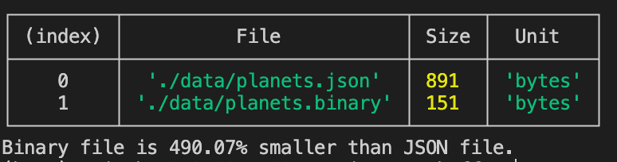

# Protocol Buffers (protobuf) vs JSON

This repository provides tools for generating and comparing data about planets in JSON and Protocol Buffers (protobuf) formats. The project includes functionalities to save data in these formats, compare file sizes, and assess the efficiency of data storage.

## Features

- **Data Generation**: Create planet data in both JSON and Protocol Buffers formats.
- **File Size Comparison**: Analyze and compare the size efficiency of JSON and Protocol Buffers data.
- **Readable Output**: Print size statistics in a formatted table for easy comparison.

## Files

- **`index.js`**: Main script to generate planet data, save it in JSON and Protocol Buffers formats, and compare file sizes.
- **`utils.js`**: Utility functions for file operations, size formatting, and table printing.
- **`jsonData.js`**: Functions to generate and save JSON data.
- **`protobufData.js`**: Functions to generate and save Protocol Buffers data.
- **`proto.sh`**: Script to generate Protocol Buffers JavaScript classes from `.proto` files.

## Installation

1. Clone the repository:

   ```bash
   git clone https://github.com/denpalrius/protobuf-vs-json.git
   ```

2. Navigate to the project directory:

   ```bash
   cd protobuf-vs-json
   ```

3. Install the required dependencies:

   ```bash
   npm install
   ```

## Generating the Schema

To generate the Protocol Buffers schema, you need to create the JavaScript classes from your `.proto` files. This is done using the `proto.sh` script.

1. Create the Protocol Buffers schema by running:

   ```bash
   npm run proto:gen
   ```

   This command executes `proto.sh`, which uses the `protoc` compiler to generate the necessary JavaScript files from the `.proto` schema definitions.

## Running the Code

After generating the schema, you can run the code to generate data, save it in JSON and Protocol Buffers formats, and compare the file sizes.

1. Run the script to generate and compare data:

   ```bash
   npm start
   ```

   This command executes `index.js`, which:
   - Generates JSON data and saves it to `./data/planets.json`.
   - Generates Protocol Buffers data and saves it to `./data/planets.binary`.
   - Prints the size of both files and compares their sizes.

## Comparison Results

The output will include a table displaying the file sizes and the percentage reduction in size of the Protocol Buffers file compared to the JSON file. For example:



This output helps illustrate the efficiency of Protocol Buffers in terms of file size compared to JSON.

Here’s the updated Acknowledgments section with the video included:

---

Here’s the updated Acknowledgments section with both Protocol Buffers and JSON included:

---

## Acknowledgments

- [Protocol Buffers](https://developers.google.com/protocol-buffers)
- [JSON (JavaScript Object Notation)](https://www.json.org/) - The widely-used format for data interchange.
- [YouTube video by Hussein Nasser](https://www.youtube.com/watch?v=46O73On0gyI&ab_channel=HusseinNasser) - Provides a comprehensive introduction to Protocol Buffers and their use cases.
